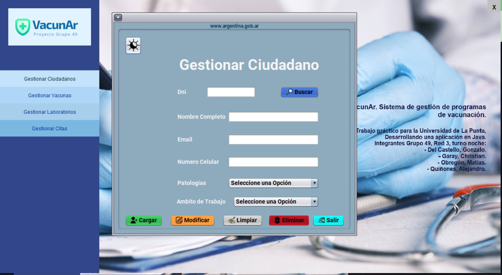
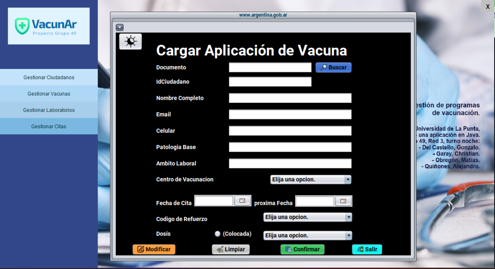
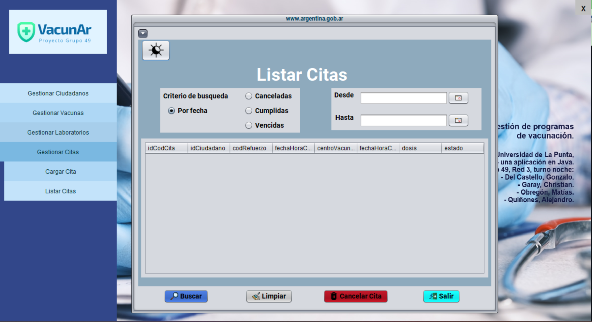

 

<h1 align="center">Hola 👋, somos los integrantes del grupo {49}    de la ULP de San Luis Argentina<a href="https://github.com/GonzaloDelCastello/universidadgrupo49/README.md"></h1>

<h3 align="center">Apasionados desarrolladores Java FullStack</h3>

* I -[Del Castello, Gonzalo]  <a href="mailto:delcastello.gonzalo@sanluis.edu.ar">Enviar correo</a> 

* II - [Garay, Christian]   <a href="mailto:christiangaray959@gmail.com">Enviar correo</a> 

* III -[Obregón, Matías]   <a href="mailto:obregonmati@gmail.com">Enviar correo</a> 

* IV -[Quiñonez, Alejandro]  <a href="mailto:m.alejandro.q@gmail.com">Enviar correo</a> 

<h3 align="left">Herramientas utilizadas:</h3>

 

<a href="https://github.com/matiiob/VacunArGrupo49/README.md" >

   
<a href="https://github.com/matiiob/VacunArGrupo49/README.md" >

   
<a href="https://github.com/matiiob/VacunArGrupo49/README.md" >

   
<a href="https://github.com/matiiob/VacunArGrupo49/README.md" >

   
<a href="https://github.com/matiiob/VacunArGrupo49/README.md" >

   
<a href="https://github.com/matiiob/VacunArGrupo49/README.md" >

   

